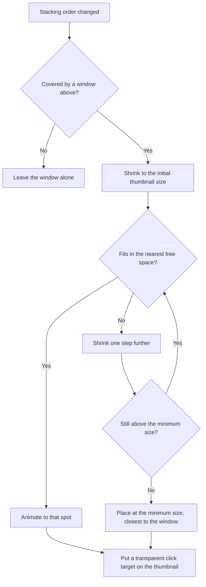

# Thumbnail Bloom

A KWin desktop effect for Plasma 6. Whenever an inactive window disappears behind another one,
Thumbnail Bloom shrinks it into a thumbnail and slides that thumbnail to the nearest free spot on
the same screen, so nothing is ever completely hidden. Click a thumbnail to bring its window back
to the front, drag it to move the window out of the thumbnail, or right-click it for the window
menu.

Windows are never actually moved or resized: they are only painted somewhere else, at a smaller
size.

## How it works

Only windows of the same screen, virtual desktop and activity are considered. The stack is walked
from the top down, so by the time a window is examined, everything covering it has already found
its final place.



## Using a thumbnail

| Gesture                    | Result                                                              |
| -------------------------- | ------------------------------------------------------------------- |
| Left click (on release)    | Activates the window and brings it to the front.                    |
| Left drag                  | Activates the window and moves it, starting from the thumbnail.     |
| Right click                | Opens the window menu, leaving the window as it is.                 |
| Tap                        | Same as a left click.                                               |
| Drag with a finger         | Same as a left drag.                                                |
| Press and hold with a finger | Same as a right click.                                            |

A drag picks the window up where its thumbnail is, not where the window really sits: the window
appears at full size around the thumbnail and follows the pointer (or the finger) from there.

Animations use the system's animation speed, so slowing animations down or turning them off in
System Settings applies here too.

## Settings

Found under System Settings, Desktop Effects, next to the effect's entry.

| Setting                   | Default     | Meaning                                                    |
| ------------------------- | ----------- | ---------------------------------------------------------- |
| Windows kept above others | skipped     | Windows with "Keep above others" stay where they are.      |
| Windows on all desktops   | skipped     | Windows shown on every desktop stay where they are.        |
| Maximized windows         | skipped     | Maximized and fullscreen windows stay where they are.      |
| Parent windows            | skipped     | Windows that own a dialog stay where they are.             |
| Child windows             | not skipped | Dialogs and other transient windows may become thumbnails. |
| Initial thumbnail size    | 50%         | Size a thumbnail is tried at first.                        |
| Minimum thumbnail size    | 15%         | Smallest size the search may fall back to.                 |
| Window icons              | shown       | Icon drawn to the left of the title of each thumbnail.     |
| Window titles             | shown       | Title drawn on a plate at the bottom of each thumbnail.    |
| Thumbnail opacity         | 70%         | Opacity of a thumbnail; a hovered one fades to opaque.     |

A skipped window stays out of the effect altogether: it never becomes a thumbnail, and it never
pushes another window into one, however much of it the skipped window covers.

The icon and the title fade out while a thumbnail is hovered, and a thumbnail too small to hold them
goes without.

The active window never becomes a thumbnail, and neither do panels, docks, menus or windows being
moved or resized.

## Building

Requires the KWin development files (`kwin-dev` on Debian and KDE neon, `kwin-devel` on Fedora,
`kwin` sources on Arch) matching the running KWin version.

```bash
cmake -B build -S . -DCMAKE_BUILD_TYPE=RelWithDebInfo -DCMAKE_INSTALL_PREFIX=/usr
cmake --build build -j$(nproc)
sudo cmake --install build
```

Then enable "Thumbnail Bloom" in System Settings, Desktop Effects.


## Disabling/Reloading from terminal
To disable the effect from terminal, run:

```bash
kwriteconfig6 --file kwinrc --group Plugins --key thumbnailbloomEnabled false
qdbus6 org.kde.KWin /Effects unloadEffect thumbnailbloom
qdbus6 org.kde.KWin /KWin reconfigure
```

A proper way to reload the effect:
```bash
qdbus6 org.kde.KWin /Effects unloadEffect thumbnailbloom
qdbus6 org.kde.KWin /Effects loadEffect thumbnailbloom
```

If soft reloading doesn't work, restart the compositor so the plugin is reloaded:

```bash
kwin_wayland --replace &   # or: kwin_x11 --replace &
```

## Limitations

A compositing effect can only paint; it cannot receive pointer input without grabbing the pointer
globally, which an always-on effect must not do. Each thumbnail therefore gets a transparent,
focus-less click target of its own, created inside the KWin process and placed exactly on top of
the thumbnail.

Because a window keeps its real position while its thumbnail is drawn elsewhere, the area the
window used to occupy still reacts to clicks. The covered part of the window was unreachable
anyway; the part that was still visible turns into an invisible click target until the window is
raised again.
